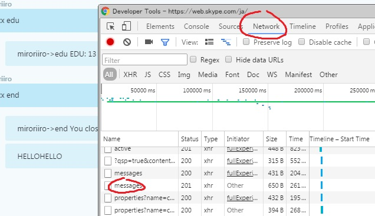
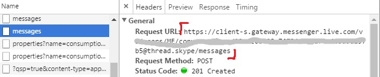
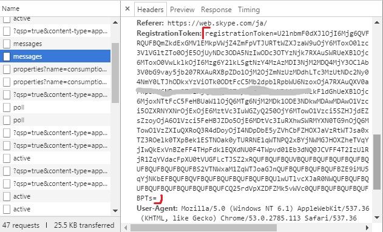

SimpleSkypeBot
===

最小構成のSkypeBotセット。

## Description

WatchDogクラスがSkypeのDBを監視して更新があったらSimpleSkypeBotを呼び出す。
SimpleSkypeBotクラスは発言の内容を調べて対応した内容をSkypeへ送る。

## Setting

Rename SkypeBot.conf.default to SkypeBot.conf in the first time.

### dbPath

    Windows - C:/Users/username/AppData/Roaming/Skype/skypeId
    Mac     - /Users/username/Library/Application Support/Skype/skypeId

### url

Open skype for web page on Chrome. Push F12 and You'll see Developer Tools. Open Network tab. Type something in the chat room where you want to use bot, and then you can find two Message items. Choose the one pointed red sign in the image.

Write Request URL at url.

### token

Scroll downward from Request URL, copy RegistrationToken and paste this long token.

